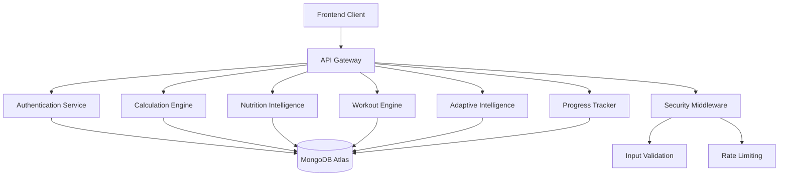

# Design Document

## Overview

SmartGain is a Node.js-based backend system that provides intelligent weight gain recommendations through personalized nutrition plans, adaptive workout programming, and comprehensive progress tracking. The system leverages scientifically-backed calculation engines for BMR/TDEE, implements adaptive intelligence for plan adjustments, and focuses on Indian food context for practical meal planning.

The architecture follows a modular, RESTful design with clear separation of concerns across calculation engines, data persistence, authentication, and adaptive intelligence components.

## Architecture

### High-Level Architecture



### Technology Stack

- **Runtime**: Node.js (LTS version)
- **Framework**: Express.js with middleware architecture
- **Database**: MongoDB Atlas with Mongoose ODM
- **Authentication**: JWT tokens with bcrypt password hashing
- **Validation**: Joi schema validation
- **Security**: Helmet, CORS, rate limiting
- **Environment**: Docker containerization support

### Folder Structure

```
src/
├── controllers/          # Request handlers
├── models/              # MongoDB schemas
├── routes/              # API route definitions
├── middleware/          # Custom middleware
├── services/            # Business logic
│   ├── calculation/     # BMR/TDEE calculations
│   ├── nutrition/       # Macro and food intelligence
│   ├── workout/         # Exercise recommendations
│   └── adaptive/        # Progress-based adjustments
├── utils/               # Helper functions
├── config/              # Configuration files
└── tests/               # Test files
```

## Components and Interfaces

### Authentication Service

**Purpose**: Manages user registration, login, and JWT token validation.

**Key Methods**:
- `registerUser(userData)`: Creates new user with encrypted password
- `authenticateUser(email, password)`: Validates credentials and returns JWT
- `validateToken(token)`: Verifies JWT and extracts user information
- `updateUserProfile(userId, updates)`: Updates user personal information

**Security Features**:
- bcrypt password hashing with 12 salt rounds
- JWT tokens with 24-hour expiration
- Password strength validation (minimum 8 characters, mixed case, numbers)

### Calculation Engine

**Purpose**: Provides scientifically-accurate BMR, TDEE, and calorie recommendations.

**BMR Calculation** (Mifflin-St Jeor Equation):
- Men: `BMR = (10 × weight_kg) + (6.25 × height_cm) - (5 × age) + 5`
- Women: `BMR = (10 × weight_kg) + (6.25 × height_cm) - (5 × age) - 161`

**TDEE Calculation**:
- Sedentary (desk job): BMR × 1.2
- Lightly active (1-3 days/week): BMR × 1.375
- Moderately active (3-5 days/week): BMR × 1.55
- Very active (6-7 days/week): BMR × 1.725
- Extremely active (physical job + exercise): BMR × 1.9

**Weight Gain Calories**:
- Conservative gain: TDEE + 300 calories
- Moderate gain: TDEE + 500 calories
- Aggressive gain: TDEE + 700 calories
- Safety cap: Maximum TDEE + 1000 calories

**Key Methods**:
- `calculateBMR(weight, height, age, gender)`: Returns basal metabolic rate
- `calculateTDEE(bmr, activityLevel)`: Returns total daily energy expenditure
- `calculateWeightGainCalories(tdee, goalIntensity)`: Returns target calories
- `recalculateRecommendations(userId)`: Updates all calculations for user

### Nutrition Intelligence

**Purpose**: Manages macro distribution and Indian food recommendations.

**Macro Distribution Strategy**:
- Protein: 25-30% of total calories (1.6-2.2g per kg body weight)
- Carbohydrates: 45-55% of total calories
- Fats: 20-30% of total calories

**Indian Food Database** (per 100g):
```javascript
const indianFoods = {
  rice: { calories: 130, protein: 2.7, carbs: 28, fat: 0.3 },
  roti: { calories: 297, protein: 11, carbs: 61, fat: 1.4 },
  dal: { calories: 116, protein: 9, carbs: 20, fat: 0.4 },
  paneer: { calories: 265, protein: 18, carbs: 1.2, fat: 20 },
  chicken: { calories: 165, protein: 25, carbs: 0, fat: 5 },
  eggs: { calories: 150, protein: 12, carbs: 1, fat: 11 }
};
```

**Key Methods**:
- `calculateMacroTargets(totalCalories, bodyWeight)`: Returns protein/carb/fat targets
- `generateMealPlan(macroTargets, preferences)`: Creates daily meal suggestions
- `getFoodNutrition(foodItem, quantity)`: Returns nutritional breakdown
- `adjustMacrosForGoals(currentMacros, progressData)`: Modifies macro ratios

### Workout Engine

**Purpose**: Generates progressive workout plans based on user fitness level and goals.

**Workout Programming Principles**:
- Beginner: 3 days/week, full-body routines, basic compound movements
- Intermediate: 4 days/week, upper/lower split, progressive overload
- Advanced: 5-6 days/week, push/pull/legs split, advanced techniques

**Progressive Overload Strategy**:
- Beginners: 2.5-5kg weight increases weekly
- Intermediate: 1.25-2.5kg weight increases weekly
- Advanced: 0.5-1.25kg weight increases or rep/set increases

**Key Methods**:
- `generateWorkoutPlan(fitnessLevel, goals, schedule)`: Creates weekly workout plan
- `progressWorkout(workoutId, performanceData)`: Applies progressive overload
- `adjustIntensity(userId, recoveryMetrics)`: Modifies workout intensity
- `recommendRestDay(overtrainingIndicators)`: Suggests recovery periods

### Adaptive Intelligence

**Purpose**: Monitors progress and automatically adjusts nutrition and workout plans.

**Adaptation Triggers**:
- Weight stagnation (no gain for 14 days): +100-150 calories
- Rapid weight gain (>1kg/week): -100-150 calories
- Overtraining indicators: Reduce workout volume by 20%
- Consistent progress: Maintain current approach

**Key Methods**:
- `analyzeProgressTrends(userId, timeframe)`: Evaluates weight and performance trends
- `adjustCalorieTargets(userId, progressData)`: Modifies daily calorie goals
- `detectOvertraining(workoutData, recoveryMetrics)`: Identifies overtraining patterns
- `optimizeMacroRatios(bodyCompositionChanges)`: Adjusts protein/carb/fat ratios

### Progress Tracker

**Purpose**: Monitors user progress and provides analytics and milestone tracking.

**Tracking Metrics**:
- Weight progression (daily, weekly, monthly trends)
- Calorie intake consistency and streaks
- Workout performance (strength gains, volume increases)
- Body composition estimates (based on weight and measurements)

**Key Methods**:
- `logDailyStats(userId, weight, calories, workoutData)`: Records daily progress
- `calculateTrends(userId, metric, timeframe)`: Analyzes progress patterns
- `identifyMilestones(userId)`: Detects achievement milestones
- `generateProgressReport(userId, period)`: Creates comprehensive progress summary

## Data Models

### User Model

```javascript
const userSchema = {
  _id: ObjectId,
  email: String, // unique, required
  password: String, // bcrypt hashed
  profile: {
    name: String,
    age: Number,
    gender: String, // 'male' | 'female'
    height: Number, // cm
    currentWeight: Number, // kg
    targetWeight: Number, // kg
    activityLevel: String, // 'sedentary' | 'light' | 'moderate' | 'very' | 'extreme'
    fitnessLevel: String, // 'beginner' | 'intermediate' | 'advanced'
    dietaryPreferences: [String], // ['vegetarian', 'non-vegetarian', 'vegan']
    healthConditions: [String]
  },
  goals: {
    weeklyWeightGain: Number, // kg per week
    targetDate: Date,
    goalIntensity: String // 'conservative' | 'moderate' | 'aggressive'
  },
  calculations: {
    bmr: Number,
    tdee: Number,
    targetCalories: Number,
    macroTargets: {
      protein: Number, // grams
      carbs: Number, // grams
      fat: Number // grams
    },
    lastCalculated: Date
  },
  createdAt: Date,
  updatedAt: Date
};
```

### Body Stats Model

```javascript
const bodyStatsSchema = {
  _id: ObjectId,
  userId: ObjectId, // reference to User
  date: Date,
  weight: Number, // kg
  bodyFat: Number, // percentage (optional)
  measurements: {
    chest: Number, // cm
    waist: Number, // cm
    arms: Number, // cm
    thighs: Number // cm
  },
  notes: String,
  createdAt: Date
};
```

### Calorie Log Model

```javascript
const calorieLogSchema = {
  _id: ObjectId,
  userId: ObjectId, // reference to User
  date: Date,
  meals: [{
    name: String, // 'breakfast' | 'lunch' | 'dinner' | 'snack'
    foods: [{
      item: String, // food name
      quantity: Number, // grams
      calories: Number,
      protein: Number,
      carbs: Number,
      fat: Number
    }],
    totalCalories: Number,
    totalProtein: Number,
    totalCarbs: Number,
    totalFat: Number
  }],
  dailyTotals: {
    calories: Number,
    protein: Number,
    carbs: Number,
    fat: Number
  },
  targetMet: Boolean,
  createdAt: Date
};
```

### Workout Log Model

```javascript
const workoutLogSchema = {
  _id: ObjectId,
  userId: ObjectId, // reference to User
  date: Date,
  workoutPlan: String, // 'full-body' | 'upper-lower' | 'push-pull-legs'
  exercises: [{
    name: String,
    category: String, // 'compound' | 'isolation'
    muscleGroups: [String],
    sets: [{
      reps: Number,
      weight: Number, // kg
      restTime: Number, // seconds
      completed: Boolean
    }],
    totalVolume: Number, // sets × reps × weight
    personalRecord: Boolean
  }],
  duration: Number, // minutes
  intensity: String, // 'light' | 'moderate' | 'high'
  notes: String,
  createdAt: Date
};
```

### Adaptation Log Model

```javascript
const adaptationLogSchema = {
  _id: ObjectId,
  userId: ObjectId, // reference to User
  date: Date,
  trigger: String, // 'weight_stagnation' | 'rapid_gain' | 'overtraining' | 'plateau'
  changes: {
    calorieAdjustment: Number, // +/- calories
    macroAdjustments: {
      protein: Number,
      carbs: Number,
      fat: Number
    },
    workoutAdjustments: {
      volumeChange: Number, // percentage
      intensityChange: String,
      restDaysAdded: Number
    }
  },
  reasoning: String,
  effectiveDate: Date,
  createdAt: Date
};
```

## Correctness Properties

*A property is a characteristic or behavior that should hold true across all valid executions of a system—essentially, a formal statement about what the system should do. Properties serve as the bridge between human-readable specifications and machine-verifiable correctness guarantees.*

### Property 1: BMR Calculation Accuracy
*For any* user with valid age, gender, weight, and height, the BMR calculation should use the correct Mifflin-St Jeor equation and produce mathematically accurate results within 1 calorie precision.
**Validates: Requirements 3.1**

### Property 2: TDEE and Weight Gain Calorie Chain
*For any* valid BMR and activity level, calculating TDEE then weight gain calories should maintain mathematical relationships (TDEE = BMR × activity_factor, weight_gain_calories = TDEE + goal_adjustment) and respect safety thresholds (≤ TDEE + 1000).
**Validates: Requirements 3.2, 3.3, 3.4**

### Property 3: Macro Distribution Constraints
*For any* total calorie target, the calculated macro distribution should fall within specified ranges (25-30% protein, 45-55% carbs, 20-30% fats) and sum to the total calories within 5 calorie tolerance.
**Validates: Requirements 4.1**

### Property 4: Authentication Security Round Trip
*For any* valid user registration data, the system should create an account, hash the password with bcrypt (≥10 salt rounds), allow login with original password, return valid JWT token, and authorize protected endpoint access.
**Validates: Requirements 2.1, 2.2, 2.3, 2.4**

### Property 5: Adaptive Calorie Adjustments
*For any* user progress data showing weight stagnation (no gain for 14 days) or rapid gain (>1kg/week), the adaptive intelligence should adjust daily calories by 100-150 in the appropriate direction.
**Validates: Requirements 6.1, 6.2**

### Property 6: Workout Plan Structure Consistency
*For any* user fitness level and goals, generated workout plans should contain 3-5 sessions per week, include compound movements, and provide complete exercise descriptions with form guidance.
**Validates: Requirements 5.1, 5.2, 5.3, 5.5**

### Property 7: Data Persistence Completeness
*For any* user data entry (body stats, calorie logs, workout logs), the database should store all required fields with accurate timestamps and maintain data integrity for retrieval.
**Validates: Requirements 7.3, 7.4, 7.5**

### Property 8: Progress Tracking Calculations
*For any* user with historical data, progress tracking should accurately calculate trends, streaks, and milestones based on the underlying data without mathematical errors.
**Validates: Requirements 8.1, 8.2, 8.3, 8.4**

### Property 9: API Response Completeness
*For any* authenticated user request to dashboard, meal plan, workout plan, or progress endpoints, the response should contain all required data fields and proper structure.
**Validates: Requirements 9.1, 9.2, 9.3, 9.4**

### Property 10: Input Validation and Security
*For any* API endpoint and input data, the security middleware should validate against schemas, sanitize inputs to prevent injection attacks, and reject invalid data with appropriate error messages.
**Validates: Requirements 10.1, 10.3**

### Property 11: Rate Limiting Enforcement
*For any* IP address making requests, the rate limiting should enforce the 100 requests per 15 minutes limit and block excess requests with appropriate HTTP status codes.
**Validates: Requirements 10.2**

### Property 12: Calculation Recalculation Consistency
*For any* user stat updates (weight, height, age, activity level), the system should recalculate BMR, TDEE, and calorie targets, and the new values should reflect the updated inputs accurately.
**Validates: Requirements 3.5**

### Property 13: Meal Plan Dietary Preference Compliance
*For any* user dietary preferences and restrictions, generated meal suggestions should only include foods that comply with the specified preferences (vegetarian, non-vegetarian, vegan).
**Validates: Requirements 4.3**

### Property 14: Overtraining Detection and Response
*For any* workout data indicating overtraining patterns (excessive volume, insufficient recovery), the adaptive intelligence should detect the pattern and recommend appropriate rest days or intensity reductions.
**Validates: Requirements 6.3**

### Property 15: Food Database Nutritional Accuracy
*For any* food item in the Indian food database, the nutritional values per 100g should be accurate and complete (calories, protein, carbs, fat) with values that sum correctly.
**Validates: Requirements 4.4**

## Error Handling

### Error Categories

**Validation Errors (400 Bad Request)**:
- Invalid input data format
- Missing required fields
- Out-of-range values (negative weight, invalid age)
- Malformed email addresses or weak passwords

**Authentication Errors (401 Unauthorized)**:
- Invalid or expired JWT tokens
- Incorrect login credentials
- Missing authentication headers

**Authorization Errors (403 Forbidden)**:
- Attempting to access another user's data
- Insufficient permissions for admin endpoints

**Resource Errors (404 Not Found)**:
- User not found
- Workout plan not found
- Non-existent food items

**Rate Limiting Errors (429 Too Many Requests)**:
- Exceeded API rate limits
- Temporary blocking for suspicious activity

**Server Errors (500 Internal Server Error)**:
- Database connection failures
- Calculation engine errors
- Unexpected system failures

### Error Response Format

```javascript
{
  "error": {
    "code": "VALIDATION_ERROR",
    "message": "Invalid input data",
    "details": {
      "field": "weight",
      "reason": "Weight must be a positive number"
    },
    "timestamp": "2024-01-15T10:30:00Z",
    "requestId": "req_123456789"
  }
}
```

### Logging Strategy

- **Error Logs**: All errors with stack traces, request context, and user ID
- **Security Logs**: Failed authentication attempts, rate limit violations
- **Performance Logs**: Slow queries, calculation times, API response times
- **Audit Logs**: User data changes, admin actions, system configuration changes

## Testing Strategy

### Dual Testing Approach

The SmartGain backend will implement both unit testing and property-based testing to ensure comprehensive coverage:

**Unit Tests**:
- Specific examples and edge cases for each component
- Integration points between services
- Error condition handling
- Database model validation
- API endpoint response formats

**Property-Based Tests**:
- Universal properties that hold across all inputs
- Mathematical calculation accuracy
- Security constraint enforcement
- Data integrity and consistency
- Business rule compliance

### Property-Based Testing Configuration

**Testing Library**: fast-check for JavaScript/Node.js property-based testing
**Test Configuration**: Minimum 100 iterations per property test
**Test Tagging**: Each property test tagged with format: **Feature: smartgain-backend, Property {number}: {property_text}**

### Test Coverage Requirements

- **Calculation Engine**: 100% coverage of BMR, TDEE, and macro calculations
- **Authentication Service**: Complete coverage of registration, login, and token validation
- **Adaptive Intelligence**: Coverage of all adaptation triggers and responses
- **API Endpoints**: All endpoints tested for success and error cases
- **Database Models**: All CRUD operations and data validation rules
- **Security Middleware**: All validation rules and security constraints

### Integration Testing

- **Database Integration**: MongoDB connection, CRUD operations, data consistency
- **Authentication Flow**: End-to-end user registration and login
- **Calculation Pipeline**: BMR → TDEE → Weight Gain Calories → Macro Distribution
- **Adaptive Adjustments**: Progress data → Analysis → Plan modifications
- **API Integration**: Request validation → Business logic → Response formatting

### Performance Testing

- **Load Testing**: API endpoints under concurrent user load
- **Database Performance**: Query optimization and indexing validation
- **Calculation Performance**: BMR/TDEE calculations under high volume
- **Memory Usage**: Monitoring for memory leaks in long-running processes